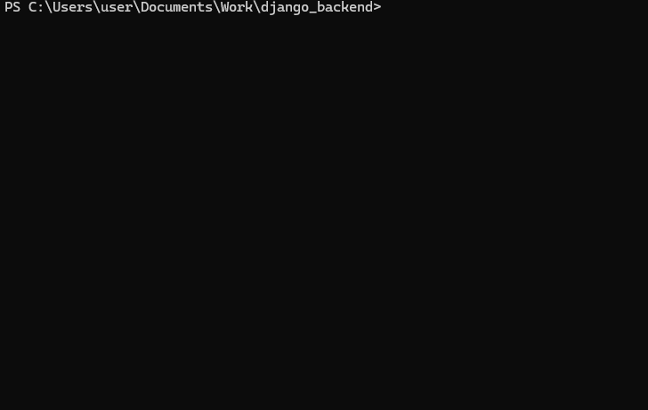

# Django Backend for ToDoList A.P.P.

This Django project serves as the backend for a task management application. It provides API endpoints for performing CRUD operations on tasks.

## Getting Started

1. Before you do anything make sure to clone this repository to your local machine.
    ```
    git clone https://github.com/your-username/django-backend.git
    ```

### Installation Method Using :whale:Docker(Highly Recommended) :sunglasses:

2. Install [Docker](https://www.docker.com/products/docker-desktop/) <br>
    :wrench: Note: On Windows, After installing your Docker may crash due to WSL not being updated/installed in your system. If this is the case, simple run this command in your Powershell Terminal
    ```
    WSL --update
    ```

3. Run this command in your Powershell Terminal

    ```
    docker compose up
    ```
    


4. Server is now up and running. To close the server simply press CTRL + C in the Terminal.

### Installation Method Manually(Not Recommended) :dizzy_face:

2. Install [Python](https://www.python.org/downloads/)

3. Create virtual environment

    ```
    py -m venv venv
    ```

4. activate virtual environment

    ```
    #for linux
    source venv/bin/activate

    #for windows
    .\venv\Scripts\activate
    ```

5. Install Dependencies using Pip inside virtual environment

    ```
    pip install -r requirements.txt
    ```

6. Navigate to directory

    ```
    cd todolist
    ```

7. Running the Server in /todolist directory

    ```
    py manage.py runserver
    ```

8. Server is now running. To close the server simply press CTRL + C in The Terminal.